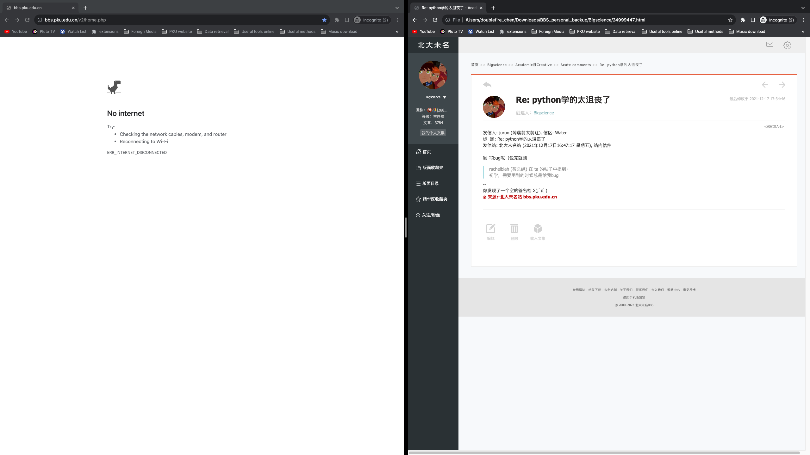
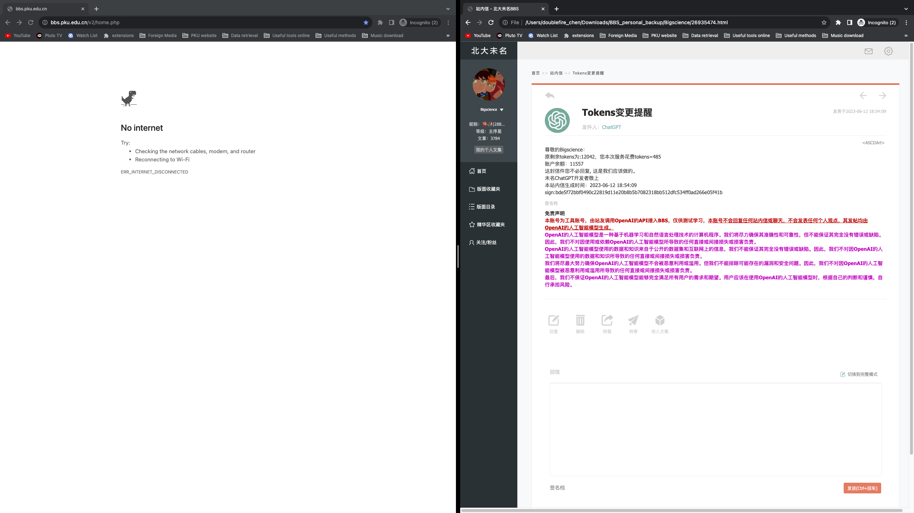
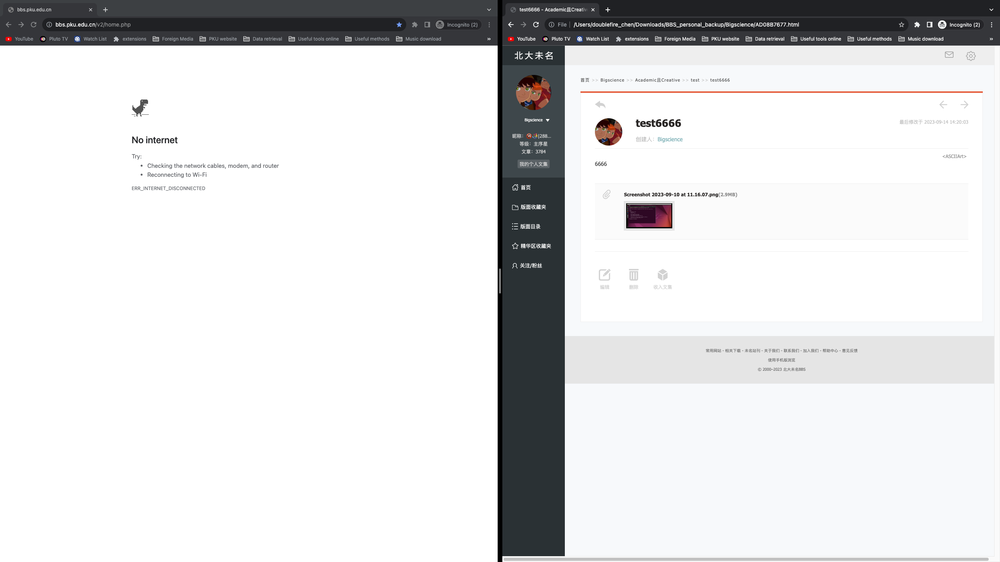
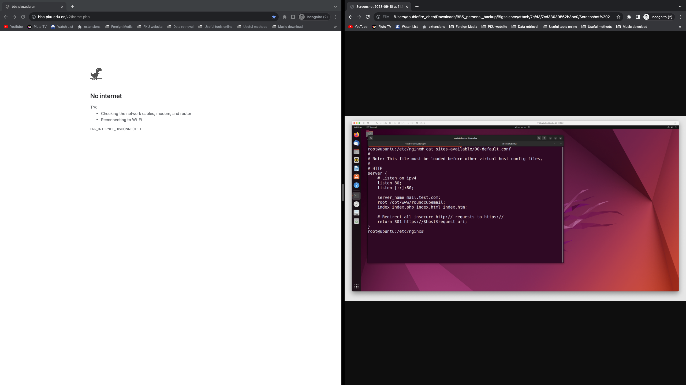
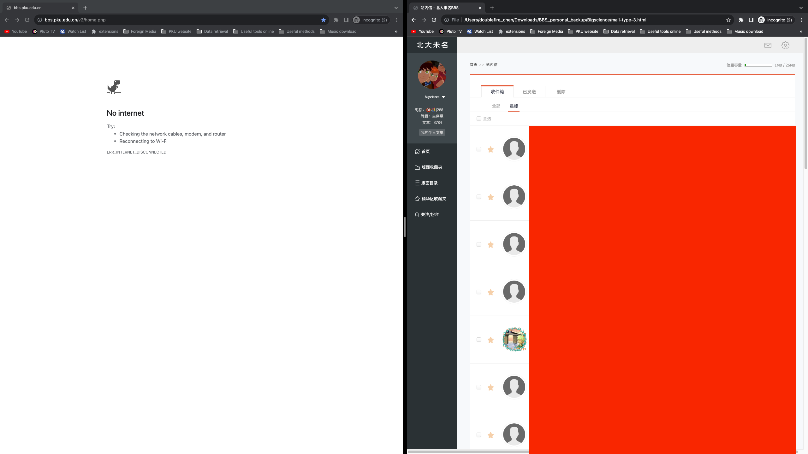
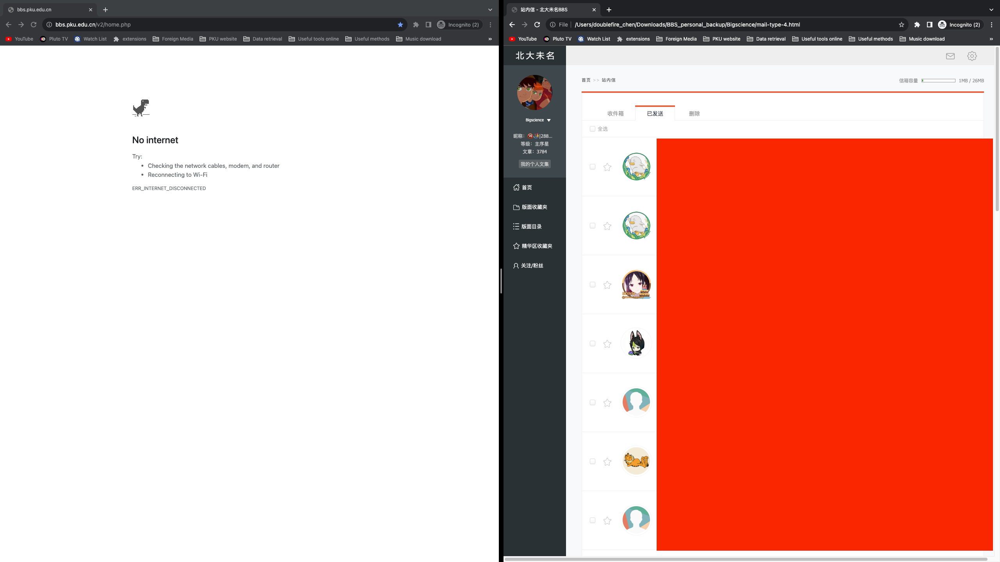
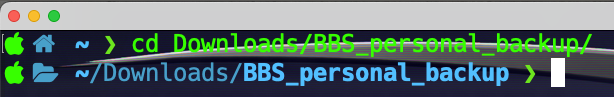
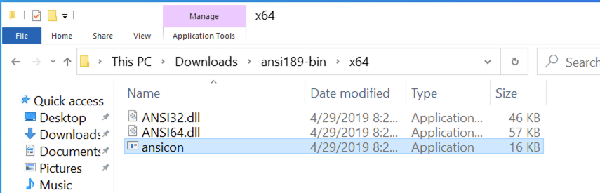
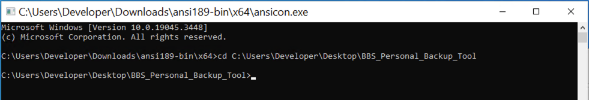

# BBS_Personal_Backup_Tool
A tool to backup personal collection and personal mails in bbs.pku.edu.cn

The backup file will be saved in the current work path.


# Screenshot















# How to use?

First of all, you need Python installed in your PC

Go the the [Python official web](https://www.python.org/) to get one, install it followed by the instrution. Remember that you should add python to the path (environment variables) during the  installation process by ticking the square.


Then download the source code in this github page.

## For Mac OS user

1. Open you terminal
2. Change the current work path to the program's path using ```cd``` command.

For example:



3. Install essential python package using the following command.
   ```
   pip install requests beautifulsoup4
   ```

   or (if pip command is not found)

   ```
   pip3 install requests beautifulsoup4
   ```

4. Run the program using the following command.

   ```
   python main.py
   ```

   or (if python command is not found)

   ```
   python3 main.py
   ```

## For Windows OS user

1. Download and unzip the latest [ANSICON](https://github.com/adoxa/ansicon/releases/download/v1.89/ansi189-bin.zip) (the traditional cmd or powershell does not support ANSI)

2. Run the ansicon exe.
   

3. Install essential python package using the following command.
   ```
   pip install requests beautifulsoup4
   ```

   or (if pip command is not found)

   ```
   pip3 install requests beautifulsoup4
   ```

4. Change the current work path to the program's path using ```cd``` command.

   

5. Run the program using the following command.

   ```
   python main.py
   ```

   or (if python command is not found)

   ```
   python3 main.py
   ```


## For Linux OS user

Same to Mac user

PS: I can not believe that a Linux user do not know how to run python on terminal🐶
